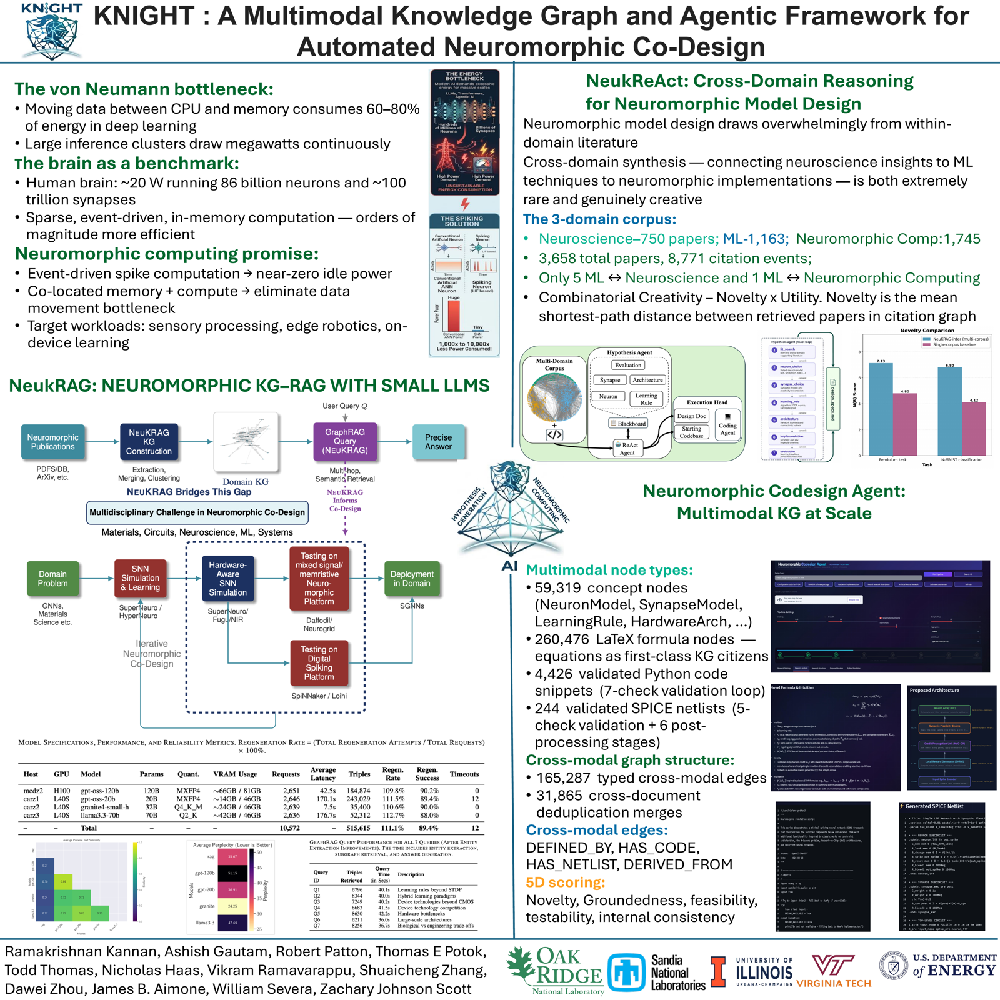

KNIGHT is presented regularly to the DOE Advanced Scientific Computing
Research (ASCR) community and at knowledge-graph / neuromorphic computing
workshops. This page summarizes public-facing talks and posters; source
decks are maintained internally and updated per venue.

<!-- ## DOE ASCR PI Meeting 2026 -- Poster

::: {.thread-card}
### KNIGHT: A Multimodal Knowledge Graph and Agentic Framework for Automated Neuromorphic Co-Design
**DOE ASCR Principal Investigators' Meeting, 2026**

Poster presenting the full KNIGHT stack -- the energy/knowledge-fragmentation
motivation, the NeuKRAG KG-RAG foundation, NeuKReAct's cross-domain
creativity results, and the Neuromorphic Codesign Agent's multimodal KG
scale-up (5,999 papers; 59,319 concept nodes; 260,476 formula nodes; 4,426
validated code snippets; 244 validated SPICE netlists).

Authors: R. Kannan, A. Gautam, R. Patton, T. E. Potok, T. Thomas, N. Haas,
V. Ramavarappu, S. Zhang, D. Zhou, J. B. Aimone, W. Severa, Z. Johnson-Scott.

{#fig-poster}
:::

## Workshop presentation -- Knowledge Graph Workshop 2026

::: {.thread-card}
### KNIGHT: Knowledge Graph-Driven Neuromorphic Co-Design
**Knowledge Graph Workshop 2026 - Oak Ridge National Laboratory - 40-minute talk - DOE ASCR**

A 27-slide deep dive covering the energy-wall motivation, the NeuKRAG 8-stage
KG construction pipeline and GraphRAG query engine, NeuKReAct's multi-corpus
agentic blackboard and combinatorial creativity metric (`N(R)`), the
Neuromorphic Codesign Agent's multimodal KG and constraint-driven code/SPICE
generation, and open research gaps for KG-RAG trustworthiness (faithfulness
vs. causality, attribution, redundancy, linearization, and graph-scale audit).

Presenters: R. Kannan, A. Gautam, R. Patton, N. Haas, T. Thomas, J. Aimone,
T. Potok -- Oak Ridge National Laboratory and Sandia National Laboratories.
:::

## ASCR Theme-1 breakout session

::: {.thread-card}
### KNIGHT Project Session -- Theme 1
**ASCR project review breakout session - ORNL / Sandia NL / Virginia Tech - DOE ASCR**

Structured as five parts -- Challenge, State of the Art, Research Direction,
Science Impact, and Future Work -- this session walks reviewers through the
von Neumann energy-wall motivation, the three-thread NeuKRAG -> NeuKReAct ->
Codesign Agent research direction, and headline results (921,545 triples,
`N(R) = 7.13` cross-domain novelty, 244 validated SPICE netlists, and
70%->88% constraint-compliance improvement from structured regeneration).
:::

## Related presentations

- **DOE ASCR project presentation** (`DOE-presentationv2.pptx`) -- positions
  KNIGHT's Agentic KG-RAG approach alongside a companion research direction,
  *HyperNeuro*, exploring spiking graph neural networks (SGNNs) and STDP as
  a path to scaling agentic KG-RAG with greater energy efficiency --
  discussion material developed in connection with a Gordon Bell 2026
  submission effort.
- **NeuKRAG detailed technical presentation** (`NEUKRAG_Presentation_with_visuals.pptx`,
  `Detailed presentation.pptx`) -- extended technical walkthroughs of the KG
  construction pipeline and GraphRAG results, used for internal reviews and
  follow-up discussions.
- **ASCR review prep decks** (`knight_aug28_ascr_v1.pptx`, `v2.pptx`) --
  working drafts prepared for an August ASCR project review.

## Related verification & validation work

A companion analysis, *"Grounded or Guessed? A Causal Attribution Framework
for Verifying Provenance in Knowledge-Graph RAG"* (Aditya et al., in
collaboration with the NeuKRAG authors), targets SIGKDD and identifies five
open gaps for trustworthy KG-RAG in scientific co-design pipelines:
faithfulness vs. causal grounding, attribution methods for hybrid
document-plus-graph context, redundancy-aware structural metrics, the
KG-to-token linearization gap, and graph-scale KG quality auditing. -->

## Invited Talks
- **Banff International Research Station, Mathematical and Statistical Foundations for Knowledge Graph Reasoning, Casa Mathematica, Oaxaca** -- Ramakrishnan Kannan
- **Keynote at ACM International Conference on Neuromorphic Systems, Chicago, Illinois 2026** -- James Brad Aimone

## Presentations
- **Great Lakes Symposium on VLSI, Newyork, 2026** -- Vikram Ramavarappu and Ashish Gautam

## Program Committee
- **Neuro Inspired Computational Elements (NICE) 2025, 2026** -- Ashish Gautam

## Organizing Committee

- **ORNL Core Universities AI Workshop (AI-CORE) 2025, 2026** -- Ramakrishnan Kannan and Thomas E Potok
- **ACM International Conference on Neuromorphic Systems 2025, 2026** -- Thomas E Potok and Ashish Gautam
- **Neuro Inspired Computational Elements Conference 2026** -- James B Aimone
- **Great Lakes Symposium on VLSI** -- Ashish Gautam

## Posters
- **ASCR CS PI Meeting 2026, Rocville, MD** -- Ramakrishnan Kannan and Ashish Gautam
- **NICE 2026, Atlanta, GA** -- Ramakrishnan Kannan and Ashish Gautam

## Tutorial
- **Introduction to Fugu: A Framework for Composing Neural Algorithms, NICE 2026, Atlanta, GA** -- Felix Wang and James Brad Aimone
- **SuperNeuro + NeuroCoreX Tutorial: Running Fast and Scalable Neuromorphic Simulations, NICE 2026, Atlanta, GA** -- Ashish Gautam
- **SuperNeuro + NeuroCoreX Tutorial: Running Fast and Scalable Neuromorphic Simulations, , ICONS 2026** -- Ashish Gautam
- **Sango, an enhanced frontend interface to Fugu, ICONS 2026** -- Felix Wang