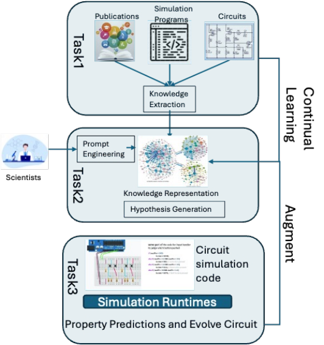
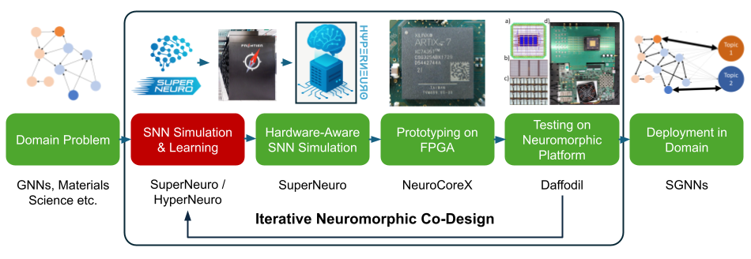
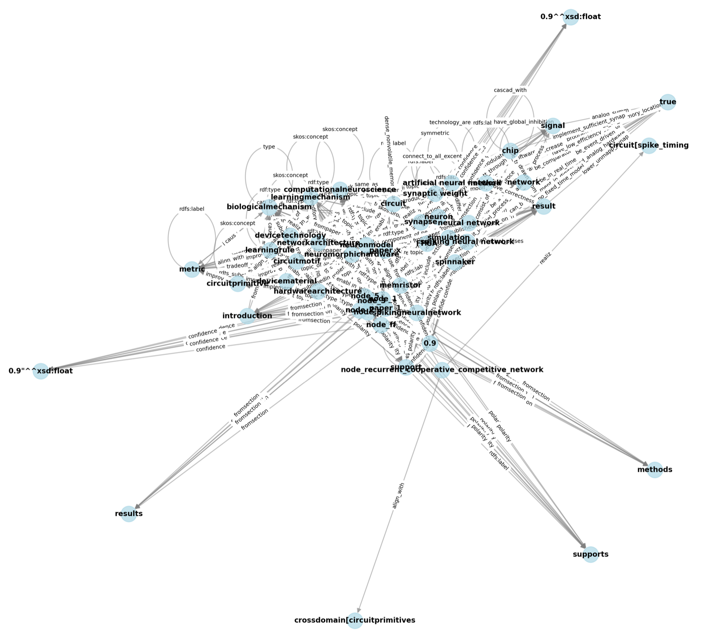

::: {.hero-banner}
::: {.hero-banner-inner}
{.hero-logo}

::: {.hero-banner-text}
**Knowledge-graph-driven reasoning for accelerating neuromorphic computing co-design**

KNIGHT builds knowledge-graph (KG) construction, GraphRAG retrieval, and agentic
reasoning systems that connect neuroscience, circuit design, device physics, and
computer architecture -- the disciplines that must be co-designed to realize
next-generation, brain-inspired computing hardware.
:::
:::
:::

## The problem: energy walls and knowledge silos

Neuromorphic computing promises orders-of-magnitude efficiency gains over
conventional AI hardware -- the human brain runs roughly 86 billion neurons and
100 trillion synapses on about 20 W, while the von Neumann bottleneck of
moving data between CPU and memory consumes 60-80% of the energy in
today's deep learning workloads. Realizing that promise requires **iterative
co-design** across neuroscience, machine learning, circuit design, device
materials, and computer architecture: a learning rule choice constrains device
variability tolerances, a circuit topology bounds achievable network
architectures, and a fabrication constraint can rule out an entire algorithmic
family.

That knowledge is scattered across thousands of publications, and it rarely
crosses domain boundaries on its own. An analysis of papers spanning
neuroscience, machine learning, and neuromorphic computing found **8,771
citation events but only 6 that bridge across all three domains** -- the
cross-domain synthesis that co-design depends on is almost never done by the
literature itself, and naive LLMs and vector-based RAG cannot reliably fill
the gap: they hallucinate, lose provenance, and cannot traverse the multi-hop
chains (device -> circuit -> learning rule -> performance) that hardware-aware
reasoning requires.

KNIGHT's central thesis is that **structured knowledge graphs are the
connective tissue** across the neuromorphic co-design stack -- from
`SuperNeuroMAT` algorithm simulation, to `NeuroCoreX` FPGA emulation, to
`Daffodil` memristive device characterization.

{#fig-overview}

## Three complementary research threads

KNIGHT is built as three progressively deeper systems, each extending the
last -- from general-purpose scientific KG construction, to cross-domain
agentic reasoning, to full multimodal co-design automation.

::: {.thread-card}
### 1. NeuKRAG -- scalable scientific KG construction & GraphRAG
*(NICE 2026 paper / SciKRAG framework)*

NeuKRAG is a general-purpose pipeline for constructing scientific knowledge
graphs from technical literature and querying them through GraphRAG. Documents
are processed through an 8-stage pipeline -- `extract -> merge -> postmerge ->
dedupe -> cluster -> embed -> ontology -> check` -- using open, lightweight LLMs
(`gpt-oss-120b`, `llama3.3:70b`, `gpt-oss-20b`, `ibm/granite4:small-h`) served
across distributed vLLM and Ollama backends. 
<!-- Applied to 2,396 neuromorphic
computing papers, the pipeline extracted **921,545 triples** with a **100%
query completion rate**.  -->
The GraphRAG query layer combines FAISS vector
similarity with k-hop graph traversal and role-specific LLM routing
(extractor -> ranker -> reasoner) to produce responses **richer** than
naive LLM baselines, with every claim traceable to a source paper and
section. This system generalizes beyond neuromorphics to any technical domain
requiring structured, explainable scientific reasoning.
:::

::: {.thread-card}
### 2. NeuKRAG (domain) & NeuKReAct -- cross-domain agentic hypothesis generation

Applied specifically to neuromorphic literature, the KG-RAG approach exposes
multi-hop relationships (e.g., device variability -> STDP robustness ->
algorithm selection) that vector search alone cannot surface. **NeuKReAct**
extends this into an agentic reasoning framework: a multi-corpus KG spans
neuroscience, machine learning, and neuromorphic
computing -- 
<!-- (750 papers), (1,163 papers), (1,745 papers) 3,658 papers unified by 8,771 citation edges.  -->
A
DSPy ReAct agent works through a **7-stage locked blackboard** --
`lit_search -> neuron_choice -> synapse_choice -> learning_rule -> architecture ->
implementation -> evaluation` -- using 11 specialized retrieval tools, then an
**execution head** turns the committed design into a structured Markdown
design document and a runnable SNNTorch codebase, completed end-to-end by an
off-the-shelf coding agent with an auto-verification retry loop. NeuKReAct
also introduces a **combinatorial creativity score** `N(R)`, the mean
shortest-path distance between retrieved papers in the citation graph, to
quantify cross-domain novelty.
 <!-- -- multi-corpus retrieval reaches `N(R) = 7.13`
versus `4.80` for a single-corpus baseline on a pendulum-control task. -->
:::

::: {.thread-card}
### 3. Neuromorphic Codesign Agent -- multimodal KG & constrained generation

The Neuromorphic Codesign Agent scales the KG and extends
it with **multimodal nodes**: typed concept nodes, LaTeX
formula nodes, validated Python code snippets, and  validated SPICE
netlists, linked by typed cross-modal edges (`DEFINED_BY`,
`HAS_CODE`, `HAS_NETLIST`, `DERIVED_FROM`) with cross-document
deduplication merges creating one connected substrate instead of
per-document silos. An interactive Streamlit application runs a
**four-strategy hypothesis engine** (limitation-, analogy-, gap-, and
conflict-driven generation) with embedding-based deduplication and
five-dimensional scoring (novelty, groundedness, feasibility, testability,
internal consistency), then produces **constraint-driven code and circuit
generation**: a seven-check validation loop for Python (raising constraint
compliance from ~70% to ~88%) and a five-check validation loop with six
post-processing stages for SPICE netlists -- closing the loop from biological
principle to a simulation-ready hardware circuit.
:::

{#fig-codesign}

## The KNIGHT stack

| Layer | System | Contribution | Corpus |
|---|---|---|---|
| 1 - KG Foundation | **NeuKRAG** | Structured, queryable KG with GraphRAG retrieval | 2,396 neuromorphic papers |
| 2 - Cross-Domain Reasoning | **NeuKReAct** | Multi-corpus agentic planning + creativity metrics | 3,658 papers (neuroscience + ML + neuromorphic) |
| 3 - Full Co-Design | **Neuromorphic Codesign Agent** | Multimodal KG -> hypothesis -> code -> SPICE circuit | 5,999 PDFs |

The common thread across all three layers is a structured knowledge graph
that stays queryable, provenance-tracked, and explainable as it grows from
text triples to a multimodal substrate spanning formulas, code, and circuits.

<!-- {#fig-kgviz} -->

## Learn more

Supporting visuals and extended narrative for this overview are drawn from
project presentations and posters -- see the [Community &
Activities](community.qmd) page for the DOE ASCR PI Meeting poster, workshop
deck, and related talks. Full technical detail is available on the
[Publications](publications.qmd) page, and the underlying software is
described on the [Software](software.qmd) page.

::: {.stat-grid}
::: {.stat-card}
[921,545]{.stat-number}
[triples - NeuKRAG (2,396 papers)]{.stat-label}
:::
::: {.stat-card}
[3,658]{.stat-number}
[papers - NeuKReAct multi-corpus KG]{.stat-label}
:::
::: {.stat-card}
[5,999]{.stat-number}
[PDFs - Codesign Agent multimodal KG]{.stat-label}
:::
::: {.stat-card}
[165,287]{.stat-number}
[cross-modal edges (concept<->formula<->code<->netlist)]{.stat-label}
:::
:::
