KNIGHT is a collaboration between Oak Ridge National Laboratory, Sandia
National Laboratories, and Virginia Tech. The roster below is drawn from the
project team slide and the author lists of the NeuKRAG, NeuKReAct, and
Neuromorphic Codesign Agent papers. Badges indicate which of the three
systems each person contributes to.

::: {.callout-note appearance="simple"}
Source materials specify the Principal Investigator explicitly; they do not
label every contributor's exact position (e.g., postdoc vs. graduate student
vs. staff scientist). Contributors are grouped by institutional affiliation
below rather than by an unverified job title. Please contact the PI to
correct or extend an entry.
:::

## Principal Investigator

::: {.people-grid}
::: {.person-card}
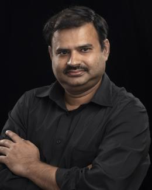{.person-photo}
[Ramakrishnan Kannan]{.person-name}\
[Oak Ridge National Laboratory]{.person-affil}

<!-- `NeuKRAG` `NeuKReAct` `Codesign Agent` -->
:::
:::

## Oak Ridge National Laboratory

::: {.people-grid}
::: {.person-card}
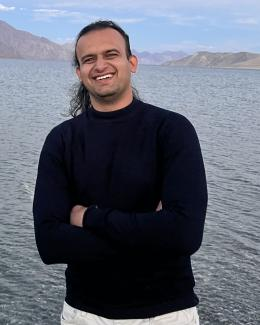{.person-photo}
[Ashish Gautam]{.person-name}\
[Oak Ridge National Laboratory]{.person-affil}

<!-- `NeuKRAG` `NeuKReAct` `Codesign Agent` -->
:::

::: {.person-card}
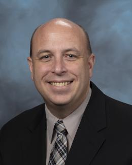{.person-photo}
[Robert Patton]{.person-name}\
[Oak Ridge National Laboratory]{.person-affil}

<!-- `NeuKRAG` `NeuKReAct` `Codesign Agent` -->
:::

::: {.person-card}
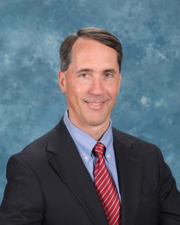{.person-photo}
[Thomas E. Potok]{.person-name}\
[Oak Ridge National Laboratory]{.person-affil}

<!-- `NeuKRAG` `NeuKReAct` -->
:::

::: {.person-card}
[TT]{.person-photo-placeholder}
[Todd Thomas]{.person-name}\
[Oak Ridge National Laboratory]{.person-affil}

<!-- `NeuKRAG` `NeuKReAct` -->
:::

::: {.person-card}
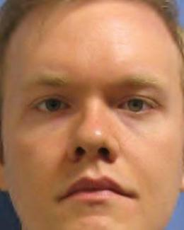{.person-photo}
[Nicholas Haas]{.person-name}\
[Oak Ridge National Laboratory]{.person-affil}

<!-- `NeuKRAG` `Codesign Agent` -->
:::

::: {.person-card}
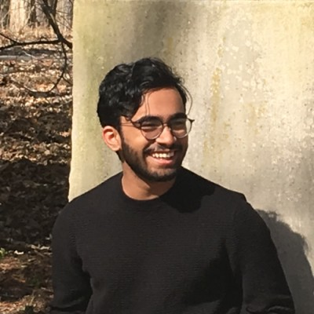{.person-photo}
[Vikram Ramavarappu]{.person-name}\
[University of Illinois -- Urbana Champagne -- Intern]{.person-affil}

<!-- `NeuKRAG` `Codesign Agent` -->
:::

::: {.people-grid}
::: {.person-card}
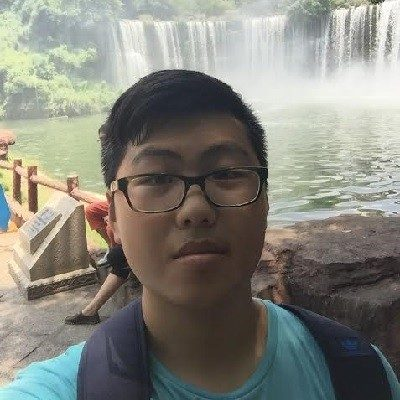{.person-photo}
[Shuaicheng Zhang]{.person-name}\
[Virginia Tech -- Intern]{.person-affil}

<!-- `Codesign Agent` -->
:::

::: {.person-card}
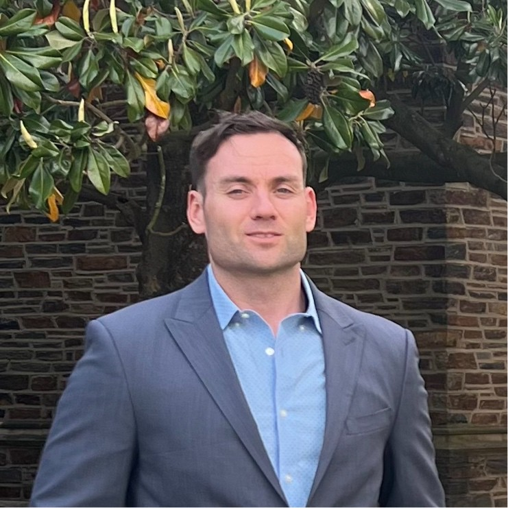{.person-photo}
[Zachary Johnson-Scott]{.person-name}\
[Oak Ridge National Laboratory]{.person-affil}
:::

::: {.person-card}
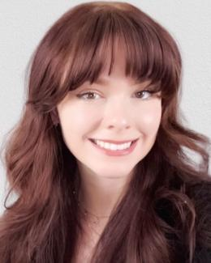{.person-photo}
[Emily J Herron]{.person-name}\
[Oak Ridge National Laboratory]{.person-affil}

<!-- `NeuKRAG` `NeuKReAct` `Codesign Agent` -->
:::
:::

## Sandia National Laboratories

::: {.people-grid}
::: {.person-card}
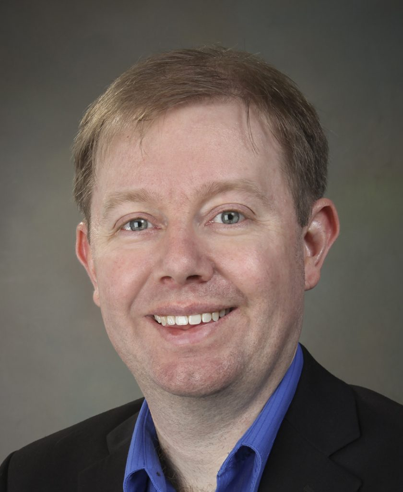{.person-photo}
[James B. Aimone]{.person-name}\
[Sandia National Laboratories]{.person-affil}

<!-- `Codesign Agent` -->
:::

::: {.person-card}
[WS]{.person-photo-placeholder}
[William Severa]{.person-name}\
[Sandia National Laboratories]{.person-affil}
:::

::: {.person-card}
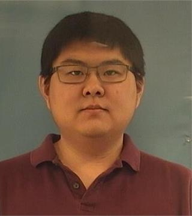{.person-photo}
[Felix Wang]{.person-name}\
[Sandia National Laboratories]{.person-affil}

<!-- `NeuKRAG` `NeuKReAct` -->
:::
:::

## Virginia Tech Collaborators

::: {.person-card}
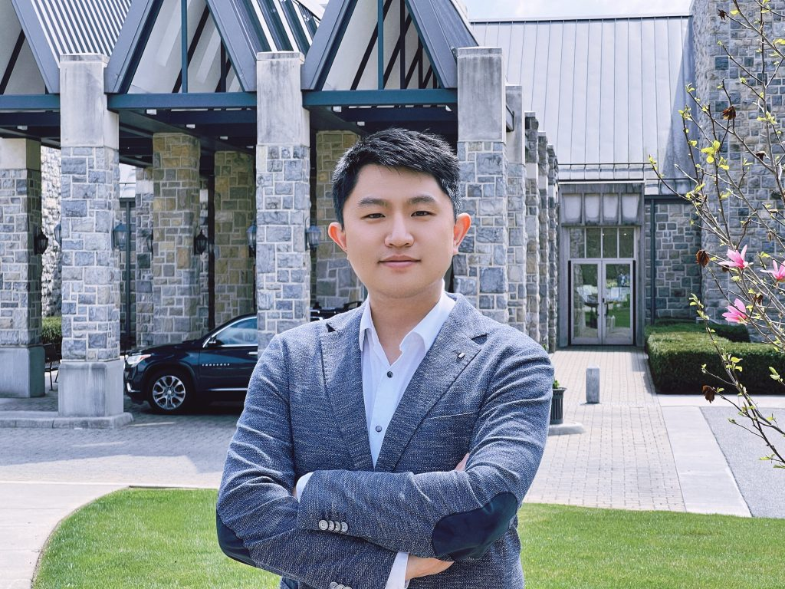{.person-photo}
[Dawei Zhou]{.person-name}\
[Virginia Tech]{.person-affil}

<!-- `Codesign Agent` -->
:::
:::

## System authorship

For full author lists and citation details, see the [Publications](publications.qmd)
page. Author affiliations as listed on the NeuKRAG (NICE 2026) paper:
Ramakrishnan Kannan, Ashish Gautam, Robert Patton, Nicholas D. Haas, Todd
Thomas, James B. Aimone, and Thomas Potok -- Oak Ridge National Laboratory and
Sandia National Laboratories.
